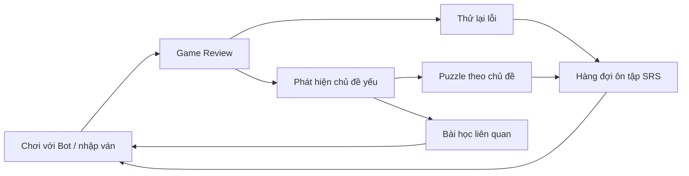
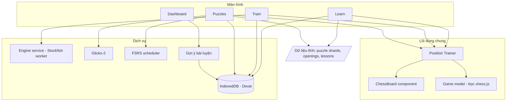

# Kế hoạch xây dựng game cờ vua (tham khảo Chess.com)

> **Trọng tâm giai đoạn đầu:** 3 module **Puzzle – Train – Learn** để tự luyện, nâng cao trình độ.
> Chơi online, xã hội, giải đấu… để sau.

---

## 1. Phân tích Chess.com

> Ghi chú: môi trường làm việc này không truy cập trực tiếp được chess.com, nên phần phân tích dựa trên
> hiểu biết về sản phẩm và các bài review công khai (2026). Chi tiết giao diện có thể lệch chút so với bản hiện tại.

### 1.1 Bản đồ tính năng

| Nhóm | Tính năng chính | Ghi chú |
|---|---|---|
| **Play** | Chơi online (bullet / blitz / rapid / daily), chơi với Bot (nhiều “nhân vật” từ ~250 đến ~3200 Elo), Coach bot, biến thể, giải đấu | Cần server realtime |
| **Puzzles** | Rated Puzzles, Puzzle Rush (3 phút / 5 phút / Survival), Puzzle Battle (đối kháng), Daily Puzzle, Custom/Themed Puzzles | Kho > 500.000 puzzle |
| **Learn** | Lessons (video + thử thách tương tác, chia theo trình độ), Courses, Openings (explorer), Endgames, Drills/Practice, Vision, Analysis board, Game Review, Insights | Nhiều mục chỉ dành cho Premium |
| **Watch / News / Social** | Stream, bài viết, bạn bè, club, diễn đàn | Không ưu tiên |

### 1.2 Các tính năng giúp tiến bộ (phần ta sẽ làm)

**Puzzles**
- **Rated:** mỗi người có rating puzzle riêng, puzzle được chọn quanh rating đó; giải đúng thì tăng, sai thì giảm
  (chess.com có tính cả thời gian giải). Có gợi ý (hint) và xem lời giải.
- **Puzzle Rush:** giải càng nhiều càng tốt trong 3 hoặc 5 phút; Survival không giới hạn thời gian;
  sai 3 lần là hết lượt; độ khó tăng dần; có bảng kỷ lục.
- **Puzzle Battle:** hai người thi Rush cùng lúc (cần online, nên để sau).
- **Themed/Custom:** chọn chủ đề (mate in 1/2/3, fork, pin, skewer, endgame, sacrifice…) và độ khó.
- **Daily Puzzle:** mỗi ngày một bài.

**Learn**
- **Lessons:** chia cấp Beginner → Intermediate → Advanced → Expert; mỗi bài gồm phần giải thích (video)
  và một chuỗi “challenge” tương tác (tìm nước đúng trên bàn cờ); xong bài này mở bài tiếp theo.
- **Openings:** cây khai cuộc có tên ECO; học tên và ý tưởng của từng khai cuộc.
- **Endgames / Drills:** cho sẵn thế cờ (vd. Vua + Xe đấu Vua), mục tiêu “chiếu hết trong N nước”
  hoặc “giữ hòa”, chơi với máy mạnh.
- **Vision:** luyện nhận diện tọa độ ô và ký hiệu nước đi trong thời gian giới hạn.

**Train.** Chess.com không có tab nào tên “Train”; các chức năng luyện tập nằm rải rác ở nhiều nơi.
Dự án này gom chúng thành một module **Train**:
- **Play vs Bots:** chọn độ mạnh, bật gợi ý, cho phép đi lại (takeback).
- **Game Review:** engine phân tích ván và phân loại từng nước (Brilliant, Great, Best, Excellent, Good, Book,
  Inaccuracy, Mistake, Miss, Blunder), tính độ chính xác (Accuracy), vẽ biểu đồ đánh giá, chỉ ra
  “Key moments”, cho **Retry** (thử lại) ở các nước sai, có Coach giải thích.
- **Analysis board, Insights:** thống kê điểm yếu theo giai đoạn ván, theo khai cuộc…

### 1.3 Vì sao Chess.com giúp người chơi tiến bộ

1. **Vòng phản hồi khép kín:** chơi → review → thử lại lỗi → luyện puzzle đúng chủ đề → học bài → chơi lại.
2. **Rating ở khắp nơi:** thấy rõ mình tiến bộ, độ khó tự điều chỉnh theo trình độ.
3. **Gamification:** streak, mục tiêu hằng ngày, kỷ lục Rush, huy hiệu.
4. **Phản hồi tức thì trên bàn cờ:** highlight, mũi tên, âm thanh, lời giải thích.
5. **UX tốt:** bàn cờ mượt, kéo-thả hoặc click-click, chạy tốt trên mobile.

Dự án sẽ tái tạo vòng lặp này và làm mạnh thêm một điểm chess.com chưa chú trọng:
**ôn tập ngắt quãng (spaced repetition)** cho các puzzle làm sai và các lỗi trong ván của chính bạn.



---

## 2. Mục tiêu và phạm vi

**MVP (v1):**
- Puzzle, Train và Learn chạy hoàn toàn trên trình duyệt; **không cần server, không cần tài khoản**.
- Dữ liệu lưu trên máy (IndexedDB), dùng được offline (PWA), cài được lên điện thoại như một app.
- Giao diện tiếng Việt, có sẵn khung i18n để thêm tiếng Anh.

**Chưa làm ở v1:** chơi online giữa người với người, Puzzle Battle, tài khoản và đồng bộ cloud,
tính năng xã hội, video bài học.

**Pháp lý:** không sao chép tên, logo, hình ảnh, nội dung bài học hay puzzle của chess.com.
Chỉ dùng dữ liệu mở:

| Thành phần | Nguồn | License |
|---|---|---|
| Puzzle | Lichess puzzle database (> 5 triệu puzzle, có rating và theme) | CC0 |
| Tên khai cuộc | `lichess-org/chess-openings` (ECO + tên + PGN) | CC0 |
| Engine | Stockfish bản WASM (npm `stockfish`) | GPL-3.0 |
| Luật cờ | `chess.js` | BSD-2-Clause |
| Bàn cờ | `react-chessboard` | MIT |
| Bộ quân SVG | vd. “cburnett” (dùng trên Lichess) | GPLv2+ (kiểm tra từng bộ) |
| Bài học | Tự viết (có thể nhờ AI soạn nháp, rồi kiểm tra lại bằng engine) | Của bạn |

Dự án đóng gói kèm Stockfish (GPL), nên đặt license của dự án là **GPL-3.0** cho đơn giản.

---

## 3. Kiến trúc và công nghệ

### 3.1 Tech stack

| Lớp | Lựa chọn | Lý do |
|---|---|---|
| Framework | React 19 + TypeScript + Vite | Phổ biến, build nhanh, nhiều tài liệu |
| Styling | Tailwind CSS 4 | Làm UI responsive nhanh |
| Router | React Router 7 | |
| State | Zustand | Nhẹ, đơn giản |
| Luật cờ | chess.js 1.x | Sinh nước hợp lệ, FEN/PGN, SAN |
| Bàn cờ | react-chessboard 5.x (phương án khác: chessground) | Kéo-thả, mũi tên, highlight ô |
| Engine | Stockfish WASM chạy trong Web Worker (giao thức UCI) | Phân tích, bot, chấm bài |
| Lưu trữ | IndexedDB qua Dexie 4 | Offline, chứa được nhiều dữ liệu |
| Rating | Glicko-2 (tự viết khoảng 100 dòng) | Cùng hệ với Lichess và chess.com |
| Ôn tập | `ts-fsrs` (thuật toán FSRS) | Lên lịch ôn thông minh |
| PWA | `vite-plugin-pwa` | Offline, cài lên điện thoại |
| Test | Vitest (unit), Playwright (e2e) | |
| CI/Deploy | GitHub Actions → Vercel hoặc Netlify | |

**Vì sao chọn web thay vì app native:** một codebase chạy được ở mọi nơi; PWA cài được lên điện thoại.
Sau này muốn đưa lên store thì bọc lại bằng Capacitor.

**Lưu ý về Stockfish đa luồng:** cần `SharedArrayBuffer`, tức là server phải trả header COOP/COEP.
GitHub Pages không đặt được header này, nên ta dùng bản **single-thread “lite”** (đủ mạnh để luyện tập)
hoặc deploy lên Vercel/Netlify và cấu hình header.

### 3.2 Kiến trúc



**Thành phần quan trọng nhất là `Position Trainer`:** nhận một thế cờ (FEN) và chuỗi nước đúng;
người chơi phải đi đúng, máy tự đi nước đáp trả. Thành phần này dùng lại ở **4 nơi**: puzzle, challenge trong
bài học, luyện khai cuộc và “Retry” lỗi sau review. Làm một lần, dùng bốn lần, nên Puzzle được làm đầu tiên.

### 3.3 Cấu trúc thư mục dự kiến

```
chess/
├─ public/
│  ├─ data/puzzles/         # shard JSON đã lọc từ Lichess (r0400.json … r2800.json)
│  ├─ data/openings.json
│  ├─ engine/               # stockfish.js + .wasm
│  └─ pieces/, sounds/
├─ content/lessons/         # bài học (JSON + PGN)
├─ scripts/
│  ├─ build-puzzles.ts      # lọc CSV Lichess → shard + chỉ mục theme
│  └─ build-openings.ts
├─ src/
│  ├─ app/                  # router, layout, providers
│  ├─ components/board/     # ChessBoard, EvalBar, MoveList, PromotionDialog
│  ├─ core/                 # game.ts, pgn.ts, fen.ts, positionTrainer.ts
│  ├─ engine/               # stockfish.worker.ts, uci.ts, analysis.ts, bot.ts
│  ├─ features/
│  │  ├─ puzzles/           # Rated, Rush, Themes, Review (SRS), Stats
│  │  ├─ train/             # Vision, Bots, Drills, GameReview, Import
│  │  └─ learn/             # LessonPlayer, Curriculum, Openings, Repertoire
│  ├─ services/             # db.ts, glicko2.ts, srs.ts, recommend.ts
│  ├─ stores/               # zustand stores
│  └─ i18n/                 # vi.json, en.json
└─ tests/                   # unit + e2e
```

---

## 4. Thiết kế chi tiết từng module

### 4.1 Module Puzzle

**Chuẩn bị dữ liệu**
- Nguồn: `lichess_db_puzzle.csv.zst`. Các cột: `PuzzleId, FEN, Moves, Rating, RatingDeviation,
  Popularity, NbPlays, Themes, GameUrl, OpeningTags`.
- Script `scripts/build-puzzles.ts`:
  - Lọc puzzle chất lượng: `Popularity ≥ 85`, `NbPlays ≥ 1000`, `RatingDeviation ≤ 80`.
  - Lấy khoảng **100.000 puzzle**, chia đều các mức rating 400–2800 (bước 100) và phủ đủ theme.
  - Xuất ra các shard `public/data/puzzles/rXXXX.json` cùng `themes-index.json`.
- Dung lượng ước tính: khoảng 10 MB thô, 3–4 MB sau khi gzip; tải lười theo mức rating cần dùng.
- **Lưu ý định dạng:** `FEN` là thế cờ *trước* nước của đối thủ. Nước đầu tiên trong `Moves` là của
  đối thủ (máy tự đi, có animation); sau đó người chơi và máy đi luân phiên. Nước đi ở dạng UCI (`e2e4`, `e7e8q`).

**Luật chấm**
- Nước đúng là nước khớp lời giải. Ngoại lệ: nước nào **chiếu hết ngay** thì luôn tính đúng,
  vì một puzzle có thể có nhiều cách chiếu hết.
- Sai một nước thì puzzle tính là “fail” (với chế độ rated); người chơi vẫn được thử tiếp hoặc xem lời giải.
- Đã dùng hint thì không được cộng điểm (tính như fail, giống Lichess).

**Các chế độ**

| Chế độ | Mô tả | Ưu tiên |
|---|---|---|
| Rated | Puzzle quanh rating của bạn; chọn độ khó Dễ (−300) / Thường / Khó (+300); tính rating bằng Glicko-2 | P0 |
| Theo chủ đề | Chọn một hoặc nhiều theme và khoảng rating | P0 |
| Ôn lỗi (SRS) | Puzzle làm sai vào hàng đợi FSRS; đến hạn thì ôn lại | P0 |
| Rush | 3 phút / 5 phút / Survival, sai 3 lần là hết; độ khó bắt đầu khoảng 600 và tăng ~50 sau mỗi câu; lưu kỷ lục | P1 |
| Từ ván của bạn | Nước sai nặng trong ván đã review được biến thành puzzle cá nhân (làm ở Phase 2) | P1 |
| Daily | Mỗi ngày một puzzle (chọn theo seed là ngày) | P2 |

**Rating**
- Glicko-2. Lần đầu người chơi tự chọn trình độ: Mới (800), Trung bình (1200), Khá (1600), với RD = 350;
  RD giảm dần khi giải nhiều.
- Rating của puzzle giữ cố định, lấy từ Lichess.
- Mỗi lần giải được xem là một “trận” với puzzle: thắng nếu đúng hết mà không dùng hint.
- (Tùy chọn, giống chess.com) điều chỉnh theo thời gian: giải quá chậm so với thời gian kỳ vọng thì được cộng ít hơn.

**Cách chọn puzzle:** mục tiêu = rating + độ lệch theo độ khó. Lấy puzzle từ shard gần nhất, bỏ qua các puzzle
đã gặp trong 30 ngày gần đây, và có 30% khả năng ưu tiên puzzle thuộc theme bạn đang yếu.

**Thống kê:** biểu đồ rating theo ngày; tỉ lệ đúng theo từng theme. Từ đó rút ra “3 chủ đề yếu nhất”,
kèm nút “Luyện ngay”.

**Phác thảo màn hình (desktop; trên mobile bàn cờ ở trên, panel ở dưới)**

```
┌──────────────────────────────┬───────────────────────────┐
│                              │ Puzzle #a1B2c  • 1450     │
│                              │ Rating của bạn: 1382      │
│          BÀN CỜ 8×8          │ ▶ Trắng đi – tìm nước     │
│   (máy tự đi nước đầu tiên)  │   tốt nhất                │
│                              │ [Gợi ý]  [Xem lời giải]   │
│                              │ ✓ Chính xác!  +12         │
│                              │ [Tiếp ▶]  [Phân tích]     │
└──────────────────────────────┴───────────────────────────┘
```

### 4.2 Module Train

**a) Vision – luyện tọa độ**
- Kiểu 1: hiện tên ô (vd. `e4`), bạn click vào ô đó; mỗi lượt 30 giây; điểm = số câu đúng.
- Kiểu 2: một ô được tô sáng, bạn chọn tên ô.
- Kiểu 3: hiện nước đi dạng SAN (vd. `Nf3`), bạn thực hiện nước đó trên bàn cờ.
- Chọn cầm Trắng, Đen hoặc ngẫu nhiên (bàn cờ lật theo). Lưu kỷ lục.

**b) Chơi với Bot**
- Các mức: 400, 800, 1200, 1600, 2000, 2400, Max.
- Cách làm yếu engine:
  - Từ 1320 trở lên: dùng `UCI_LimitStrength` + `UCI_Elo` của Stockfish.
  - Dưới 1320: tự làm yếu. Chạy MultiPV 4–8 ở depth thấp rồi chọn nước theo xác suất
    (softmax trên điểm đánh giá, “nhiệt độ” tùy theo mức bot); thỉnh thoảng cố ý bỏ qua đe dọa.
- Tùy chọn: chọn màu quân; có hoặc không có đồng hồ; gợi ý (engine vẽ mũi tên); đi lại;
  thanh đánh giá (mặc định ẩn); bắt đầu từ một FEN bất kỳ.
- Hết ván có nút **Review**.

**c) Drills – thực hành thế cờ**
- Mỗi thế cờ có mục tiêu: “Chiếu hết trong ≤ N nước”, “Thắng” hoặc “Giữ hòa”. Đối thủ là Stockfish full sức.
- Bộ bài đầu tiên:
  - Chiếu hết cơ bản: Hậu, Xe, hai Xe, hai Tượng (nâng cao: Tượng + Mã).
  - Tàn cuộc tốt: đối vương (opposition), quy tắc hình vuông, ô then chốt.
  - Tàn cuộc Xe: Lucena, Philidor.
  - Chuyển hóa ưu thế.
- Chấm sao theo số nước so với “par” đặt sẵn: 3★ khi đạt par, 2★ khi đạt mục tiêu, 1★ khi hoàn thành.

**d) Phân tích và Game Review**
- Nguồn ván:
  - Ván vừa chơi với bot.
  - Dán PGN.
  - **Nhập ván thật của bạn trên chess.com** qua Public API
    `https://api.chess.com/pub/player/{username}/games/archives`, hoặc từ Lichess qua
    `https://lichess.org/api/games/user/{username}`.
- Stockfish phân tích từng nước (depth 14–18, chạy nền, có thanh tiến độ); kết quả được cache lại.
- Quy đổi điểm sang tỉ lệ thắng: `Win% = 50 + 50 · (2 / (1 + e^(−0.00368208 · cp)) − 1)`.
- Phân loại nước theo mức Win% bị mất của người đi (ngưỡng khởi điểm, tinh chỉnh khi thử nghiệm):

  | Loại | Win% bị mất |
  |---|---|
  | Best | Trùng nước tốt nhất của engine |
  | Excellent | ≤ 2 |
  | Good | ≤ 5 |
  | Inaccuracy | ≤ 10 |
  | Mistake | ≤ 20 |
  | Blunder | > 20 |

  Các loại khác:
  - **Book:** nước còn nằm trong cây khai cuộc.
  - **Miss:** bỏ lỡ cơ hội trừng phạt nước sai của đối thủ.
  - **Brilliant / Great:** dùng heuristic, làm sau. Brilliant là hy sinh quân mà vẫn là nước tốt nhất;
    Great là nước duy nhất giữ được thế cờ.
- Accuracy mỗi nước theo công thức của Lichess: `103.1668 · e^(−0.04354 · ΔWin%) − 3.1669`.
  Accuracy cả ván lấy trung bình.
- Giao diện: biểu đồ eval, danh sách nước kèm icon phân loại, mũi tên chỉ nước tốt nhất, “Key moments”,
  nút **Thử lại** tại mỗi lỗi (dùng Position Trainer).
- Mỗi Mistake/Blunder tự động thành **puzzle cá nhân** và được đưa vào hàng đợi ôn tập SRS.

### 4.3 Module Learn

**Định dạng bài học** (JSON, viết tay và đưa vào git):

```json
{
  "id": "tactics-fork-01",
  "level": "intermediate",
  "title": "Đòn chĩa đôi (Fork)",
  "relatedThemes": ["fork"],
  "steps": [
    { "type": "explain", "fen": "…", "text": "Mã là quân chĩa đôi nguy hiểm nhất…",
      "arrows": ["c7e8", "c7a8"], "highlights": ["c7"] },
    { "type": "find-move", "fen": "…", "solution": ["d5c7", "e8d7", "c7a8"],
      "hint": "Tìm ô mà Mã tấn công cùng lúc Vua và Xe", "success": "Chuẩn! Mã ăn được Xe." },
    { "type": "quiz", "fen": "…", "question": "Quân nào đang bị ghim?", "answer": { "square": "f6" } },
    { "type": "play-out", "fen": "…", "goal": "win", "maxMoves": 10 },
    { "type": "puzzle-set", "themes": ["fork"], "count": 10 }
  ]
}
```

**Các loại bước:**
- `explain`: bàn cờ kèm mũi tên/highlight và lời giải thích.
- `find-move`: tìm nước đúng (dùng Position Trainer).
- `quiz`: chọn ô hoặc chọn đáp án.
- `play-out`: chơi tiếp với engine cho đến khi đạt mục tiêu.
- `puzzle-set`: làm 10 puzzle thuộc theme liên quan, độ khó vừa trình độ.

**Lộ trình học (v1 khoảng 30 bài; Khai cuộc và Trung cuộc bổ sung ở v1.x)**

| Cấp | Nội dung |
|---|---|
| Nền tảng (0–800) | Bàn cờ và tọa độ; cách đi và ăn quân; chiếu, chiếu hết, hết nước đi; nhập thành, bắt tốt qua đường, phong cấp; giá trị quân; chiếu hết cơ bản (Hậu, Xe, hai Xe); nguyên tắc khai cuộc |
| Chiến thuật (800–1400) | Chĩa đôi, ghim, xiên, tấn công phát hiện, tấn công kép, loại bỏ quân phòng thủ, dụ / chặn / làm quá tải, nước trung gian, chiếu hết hàng cuối; các mẫu mate (Smothered, Anastasia, Arabian, Boden, Legal) |
| Tàn cuộc (800–1600) | Đối vương, quy tắc hình vuông, ô then chốt; tốt thông; Lucena, Philidor; tàn cuộc Hậu đấu tốt |
| Khai cuộc (v1.x) | Italian, Ruy Lopez, Sicilian, French, Caro-Kann, Queen’s Gambit, London: ý tưởng chính và bẫy phổ biến |
| Trung cuộc (v1.x) | Cấu trúc tốt (tốt cô lập, tốt chồng, tốt thông, tốt lạc hậu), Tượng tốt / Tượng xấu, tiền đồn, cột mở, lập kế hoạch, phòng ngừa |

**Khai cuộc**
- **Explorer:** cây nước đi hiển thị tên khai cuộc ngay khi đi (dataset CC0, khoảng 3.500 biến).
- **Repertoire trainer:** bạn lưu các biến của mình cho Trắng và Đen. Khi luyện, máy đi nước của đối phương
  và bạn phải nhớ nước trong repertoire. Mỗi nút trong cây được ôn bằng SRS (giống MoveTrainer của Chessable).
- (Sau này) thống kê tỉ lệ thắng từ Lichess Opening Explorer API (cần có mạng).

**Tiến độ học:** đánh dấu bài đã xong, chấm sao, mở khóa theo cấp. Bài tiếp theo được gợi ý dựa trên
các theme yếu ở module Puzzle.

### 4.4 Dashboard và thành phần chung

- **Home:**
  - Rating puzzle và streak số ngày.
  - Mục tiêu hôm nay, vd. 20 puzzle + ôn lỗi + 1 bài học.
  - Số thẻ SRS đến hạn.
  - Nút “Luyện điểm yếu”.
- **Settings:**
  - Giao diện: theme bàn cờ và bộ quân, hiện tọa độ, tự lật bàn, ngôn ngữ.
  - Thao tác: âm thanh, tốc độ animation, kéo-thả hoặc click.
  - Dữ liệu: **xuất/nhập file backup JSON**, vì dữ liệu chỉ nằm trên máy.

---

## 5. Mô hình dữ liệu (IndexedDB)

| Bảng | Trường chính |
|---|---|
| `profile` | `ratings.puzzle {r, rd, vol}`, settings, streak, createdAt |
| `puzzleAttempts` | id, puzzleId, ts, success, timeMs, usedHint, ratingBefore, ratingAfter, themes |
| `srsCards` | id, kind (`puzzle` / `mistake` / `opening`), refId, fen, solution, trạng thái FSRS (due, stability, difficulty, reps, lapses) |
| `rushRuns` | id, mode, score, mistakes, ts |
| `games` | id, source (`bot` / `pgn` / `chess.com` / `lichess`), pgn, result, ts, analysis (eval từng nước, phân loại) |
| `lessonProgress` | lessonId, completedSteps, stars, completedAt |
| `repertoire` | id, color, name, tree |
| `drillResults` | drillId, stars, bestMoves, ts |
| `visionRuns` | mode, color, score, ts |

---

## 6. Lộ trình (roadmap)

> Ước lượng cho **1 người làm toàn thời gian**. Nếu làm buổi tối / part-time thì nhân khoảng 2–2,5 lần.

**Thứ tự làm và lý do:** Puzzle → Train → Learn.
1. Puzzle cho hiệu quả luyện tập cao nhất (chiến thuật quyết định phần lớn kết quả ván ở trình độ < 1800),
   có dữ liệu dùng ngay và tạo ra Position Trainer để các module sau dùng lại.
2. Train cần engine. Engine đã dựng ở Phase 0 nên làm tiếp được ngay.
3. Learn bị chặn bởi việc **viết nội dung**, nên làm engine bài học sau. Nội dung bài thì viết song song ngay từ Phase 1.

### Phase 0 — Nền móng (~1 tuần)
- [x] Khởi tạo Vite + React + TS + Tailwind, Vitest; CI và deploy GitHub Pages trên GitHub Actions. (Chưa có ESLint/Prettier.)
- [x] Component `ChessBoard` (chessground): kéo-thả và click-click, hộp chọn phong cấp, highlight nước vừa đi, mũi tên, âm thanh, 4 màu bàn cờ.
- [x] `MoveTable`, `EvalBar`, `EvalGraph` dùng chung (logic ván cờ dùng trực tiếp chess.js).
- [x] Engine service: Stockfish 19 lite (WASM, single-thread) chạy trong Web Worker, hàng đợi phân tích, MultiPV, giới hạn Elo.
- [x] Dexie DB; layout và điều hướng (Home, Puzzles, Train, Learn, Settings); giao diện tiếng Việt.
- **Xong khi:** hai người chơi được một ván đúng luật trên cùng một máy, engine trả về nước tốt nhất, bản build đã lên mạng.

### Phase 1 — Puzzle (~2–3 tuần)
- [x] Script dựng dữ liệu puzzle (lọc và chia shard) cùng chỉ mục theme; workflow **Build puzzle data** chạy trên GitHub Actions.
- [x] `Position Trainer`: tự đi nước đối thủ, kiểm tra nước, chấp nhận nước chiếu hết thay thế, hint, xem lời giải.
- [x] Chế độ Rated + Glicko-2 + chọn độ khó.
- [x] Chế độ theo chủ đề (lọc theme, chọn puzzle quanh rating của bạn).
- [x] Ôn lỗi bằng SRS (FSRS).
- [x] Puzzle Rush (3 phút / 5 phút / Survival) cùng kỷ lục.
- [x] Thống kê: biểu đồ rating, tỉ lệ đúng theo theme, theme yếu nhất.
- **Xong khi:** giải liên tục 50 puzzle không lỗi giao diện, rating cập nhật đúng (có unit test Glicko-2),
  puzzle sai xuất hiện lại đúng lịch ôn.

### Phase 2 — Train (~3 tuần)
- [x] Vision trainer (Tìm ô / Gọi tên ô, chọn Trắng/Đen/ngẫu nhiên, kỷ lục).
- [x] Chơi với bot (7 mức, gợi ý, đi lại, xin thua; ván tự lưu để phân tích). Chưa có đồng hồ.
- [x] Analysis board (thanh eval, 3 biến MultiPV, tải FEN/PGN).
- [x] Game Review: phân tích nền, phân loại nước (kể cả nước khai cuộc), accuracy, biểu đồ, thời điểm quan trọng.
- [x] Thêm ván bằng PGN. (Đã bỏ nhập từ chess.com/Lichess theo yêu cầu: app chỉ để tự luyện, không đồng bộ với hệ thống khác.)
- [x] “Thử lại” lỗi; tự tạo puzzle cá nhân và đưa vào SRS.
- [x] Drills: 10 thế chiếu hết và tàn cuộc cơ bản (đã kiểm tra bằng Stockfish), chấm sao.
- **Xong khi:** nhập được 1 tháng ván từ tài khoản chess.com của bạn, review xong một ván 40 nước trong
  thời gian hợp lý trên laptop, các lỗi xuất hiện trong hàng đợi ôn tập.

### Phase 3 — Learn (~3–4 tuần, nội dung viết liên tục)
- [x] Lesson engine với 6 loại bước (giải thích, đi quân, chọn ô, trắc nghiệm, puzzle theo chủ đề, liên kết drill), lưu tiến độ và chấm sao.
- [x] 17 bài đầu tiên (Nền tảng 6, Chiến thuật 7, Tàn cuộc 4; xem `src/content/lessons.ts`); mọi đáp án đã kiểm tra bằng Stockfish. Sẽ bổ sung dần tới ~30 bài (trung cuộc, khai cuộc).
- [x] Opening explorer với tên khai cuộc (3.815 biến, CC0 của Lichess).
- [x] Repertoire trainer (SRS theo từng dòng).
- **Xong khi:** học hết một lộ trình từ đầu đến cuối, mỗi bài kết thúc bằng một bộ puzzle đúng chủ đề.

### Phase 4 — Hoàn thiện (~1–2 tuần)
- [x] Dashboard: mục tiêu ngày, streak, gợi ý luyện theo điểm yếu.
- [x] Daily puzzle; backup và khôi phục dữ liệu; giao diện mobile cơ bản.
- [x] Web app manifest: cài lên màn hình chính điện thoại.
- [x] Lưu dữ liệu: tự động trong trình duyệt (yêu cầu lưu bền vững), lưu online tùy chọn vào Gist bí mật của GitHub với gộp dữ liệu nhiều thiết bị; lưu ván đang chơi dở.
- [ ] Chạy offline (service worker); thêm tiếng Anh.

### Phase 5 — Sau MVP (tùy chọn)
- [x] Chơi online theo phòng: Cloudflare Worker + Durable Objects, mật khẩu phòng, danh sách phòng, đồng hồ, cầu hòa/xin thua/chơi lại, vào lại ván.
- Tài khoản và đồng bộ cloud (vd. Supabase).
- Chơi online realtime: WebSocket, ghép cặp, Elo.
- Puzzle Battle.
- Bot có “tính cách”.
- Coach giải thích bằng AI: LLM đọc kết quả phân tích của engine rồi giải thích bằng tiếng Việt.

**Tổng thời gian cho MVP (Phase 0–4): khoảng 10–13 tuần toàn thời gian.**

---

## 7. Rủi ro và cách xử lý

| Rủi ro | Cách xử lý |
|---|---|
| Viết nội dung Learn tốn nhiều thời gian | Bắt đầu viết sớm, song song với code; dùng puzzle theo theme làm bài tập; AI soạn nháp, engine kiểm tra lại |
| Engine chạy nặng trên điện thoại | Dùng bản lite single-thread, giới hạn depth/thời gian, chạy trong worker, phân tích nền và cache kết quả |
| Dữ liệu puzzle quá lớn | Lọc còn khoảng 100.000 bài, chia shard, tải lười, cache bằng Service Worker |
| Mất dữ liệu (vì chỉ lưu trên máy) | Xuất/nhập backup JSON; đồng bộ cloud ở Phase 5 |
| License GPL | Dự án dùng GPL-3.0, ghi rõ nguồn dữ liệu và thư viện trong README / trang About |
| Thiếu header COOP/COEP | Dùng Stockfish single-thread hoặc chọn host cho phép đặt header |

---

## 8. Gợi ý lịch tự luyện khi MVP xong

Mỗi ngày 30–45 phút:
1. **5–10 phút:** ôn các thẻ SRS đến hạn (lỗi cũ).
2. **15 phút:** Rated puzzle, độ khó Thường. Mỗi tuần một buổi chọn độ khó Khó và không vội để luyện tính toán sâu.
3. **5 phút:** Puzzle Rush để luyện phản xạ.
4. **10 phút:** một bài Learn hoặc một drill tàn cuộc.
5. **Cuối tuần:** 2–3 ván rapid (15+10) với bot hoặc trên chess.com, sau đó Review và thử lại các lỗi.

Mỗi tuần xem lại rating puzzle và các theme yếu để chọn trọng tâm cho tuần tiếp theo.

---

## 9. Các quyết định cần xác nhận trước khi code

1. **Nền tảng:** Web/PWA (đề xuất) hay app native?
2. **Hosting:** ~~Vercel, Netlify hay GitHub Pages?~~ Đã chọn **GitHub Pages** (Stockfish sẽ dùng bản single-thread).
3. **License GPL-3.0** cho dự án: đồng ý không?
4. Có cần **nhập ván từ tài khoản chess.com** của bạn ngay ở Phase 2 không? (Đề xuất: có, vì đây là nguồn lỗi thật để luyện.)

**Trạng thái (10/2026):** đã xong Phase 0–3 (Puzzle, Train, Learn) và phần lớn Phase 4, chạy trên GitHub Pages.
